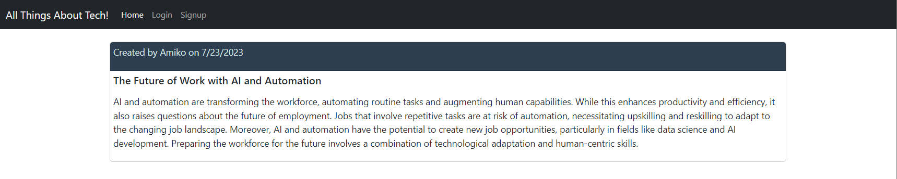

# All_Things_About_Tech
[](https://tunestack-v1-74649ac6d540.herokuapp.com/)
[](https://github.com/jenho-webdev/All_Things_About_Tech)

A simple Tech Blog

Welcome to the All Thing About Tech. A blog/post web app! This is a simple and intuitive web application that allows users to create, read, and delete blog posts. Whether you're a seasoned writer or just getting started with writing, this program provides an easy-to-use platform to share your thoughts and ideas related to tech with the world.

- [Explore the docs]( https://github.com/jenho-webdev/All_Things_About_Tech)

- [Report Bug](https://github.com/jenho-webdev/All_Things_About_Tech/issues/)

- [Request Feature](https://github.com/jenho-webdev/All_Things_About_Tech/issues)

## Table of Contents

- [All\_Things\_About\_Tech](#all_things_about_tech)
  - [Table of Contents](#table-of-contents)
  - [Features](#features)
  - [Installation](#installation)
  - [API Endpoints](#api-endpoints)
  - [Demo](#demo)
  - [Contributing](#contributing)
  - [License](#license)
  - [Credits](#credits)
  - [Contact](#contact)

## Features

- CRUD operations for products, categories, and tags
- Associations between products, categories, and tags
- RESTful API endpoints
- Error handling and response status codes
- Database seed files for testing and development

## Installation

1. Clone the repository:

```bash
   git clone https://github.com/jenho-webdev/All_Things_About_Tech.git
```

2. Install dependencies


```bash
cd All_Things_About_Tech
npm install
```

3. Set up the database

Create a MySQL database using the schema.sql under the db folder and create your own .env file using the provided example.

Seed the database: 

If you wish to test the program with some dummy data, you are welcome to seed it with the provided data in the seeds folder.

4.  To seed the database with sample data

```bush
npm run seed
```

5. Start the server

```bush
npm run start
```


The server will be running at `http://localhost:3001`.

## API Endpoints

For Articles:

- **GET /api/articles/**: Get all article.
- **Post /api/articles/**: Create new article for current logged in user.
- **DELETE /api/articles/**: Delete a article by ID.
  
-------------------------------------------------------------------------

For users:

- **Post /api/users/**: Create new user.
- **Post /api/users/login**: login a user
- **DELETE /api/users/logout**: Log out current user.


## Demo





## Contributing

Contributions are welcome! If you find any issues or have suggestions for improvements, please feel free to open an issue or submit a pull request.

## License

This project is licensed under the [](https://github.com/jenho-webdev/ERM/blob/main/LICENSE)

> For details of the application's licensing details, please visit the License page in the repo [here](https://github.com/jenho-webdev/ERM/blob/main/LICENSE)
>
>
In the above example, the "Configuration" section explains how to set up the environment variables using the `.env` file and references the `.env.example` file as a template. It also emphasizes the importance of not committing the `.env` file to version control and includes a note to add it to the `.gitignore` file.

Feel free to modify and adapt this example to fit your specific project requirements.


## Credits

Simple ERM was created by me as part a coding challenge for the UCI Full Stack bootcamp course assignment related to topics on OOP, node js., Express.js, Heroku deployment, and more.

The development of this program was supported by the course materials and resources provided by the bootcamp.

Shield and badges used in this markdown document were sourced from Shields.io.

## Contact

For any inquiries or questions, welcome to contact me @
[![LinkedIn][linkedin-shield]](https://www.linkedin.com/in/jen-h-202a1723/)[![Github][Github-shield]](https://github.com/jenho-webdev/Personal-Portfolio)[![Slack][slack-shield]](https://jenworkspace-as73396.slack.com/archives/C052QLTJQHG)

<!-- MARKDOWN LINKS & IMAGES -->
<!-- https://www.markdownguide.org/basic-syntax/#reference-style-links -->
[linkedin-shield]: https://img.shields.io/badge/-LinkedIn-black.svg?style=for-the-badge&logo=linkedin&colorB=555
[Github-shield]:https://img.shields.io/badge/GitHub-100000?style=for-the-badge&logo=github&logoColor=white
[slack-shield]:https://img.shields.io/badge/Slack-4A154B?style=for-the-badge&logo=slack&logoColor=white

